## Exercícios Resolvidos Vetor VisualG!
-----
#### Lógica de Progamação Vetores!
##### Aluno: Ramirez Marques
----
**01 - Faça um programa que leia um número inteiro positivo N (máximo = 10) e
depois N números inteiros e armazene-os em um vetor. Em seguida, mostrar na tela todos os números negativos lidos.**

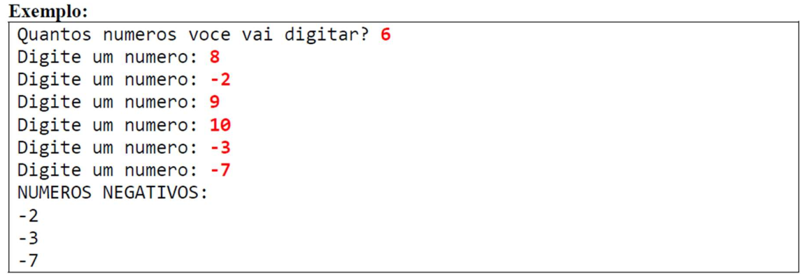
```
algoritmo "ExercicioVetor1"
var
   n,i,val: inteiro
   vet:vetor [0..9] de inteiro
inicio
   escreval ("Quantos Numeros voçê vai digitar? ")
   leia (n)

   para i de 0 ate n-1 faca
      escreval ("Digite um numero: ")
      leia (vet[i])
   fimpara
   
   escreval ("Números Negativos! ")
   para i de 0 ate n-1 faca
      se vet[i] < 0 entao
         escreval (vet[i])
      fimse
   fimpara
fimalgoritmo
```
**02 - Faça um programa que leia N números reais e armazene-os em um vetor. Em
seguida:
Imprimir todos os elementos do vetor.
Mostrar na tela a soma e a média dos elementos do vetor.**

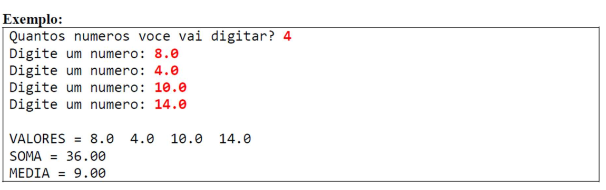
```
algoritmo "ExercicioVetor2"
var
   n,i: inteiro
   soma,media: real
   vet: vetor [0..9] de real
inicio
   escreval ("Quantos Números irá Informar? ")
   leia (n)
   soma <- 0

   para i de 0 ate n-1 faca
      escreval ("Digite um Número: ")
      leia (vet[i])

   fimpara

   para i de 0 ate n-1 faca
      soma <- soma + vet[i]
   fimpara

   media <- soma/n

   escreva ("Valores : ")
   para i de 0 ate n-1 faca
      escreva (" ", vet[i]:3:1)
   fimpara
   escreval
   escreval ("SOMA = ", soma:3:1)
   escreval ("MÉDIA = ", media:3:1)


fimalgoritmo
```
**03 - Fazer um programa para ler nome, idade e altura de N pessoas, conforme
exemplo. Depois, mostrar na tela a altura média das pessoas, e mostrar também aporcentagem de pessoas com menos de 16 anos, bem como os nomes dessas
pessoas caso houver.**

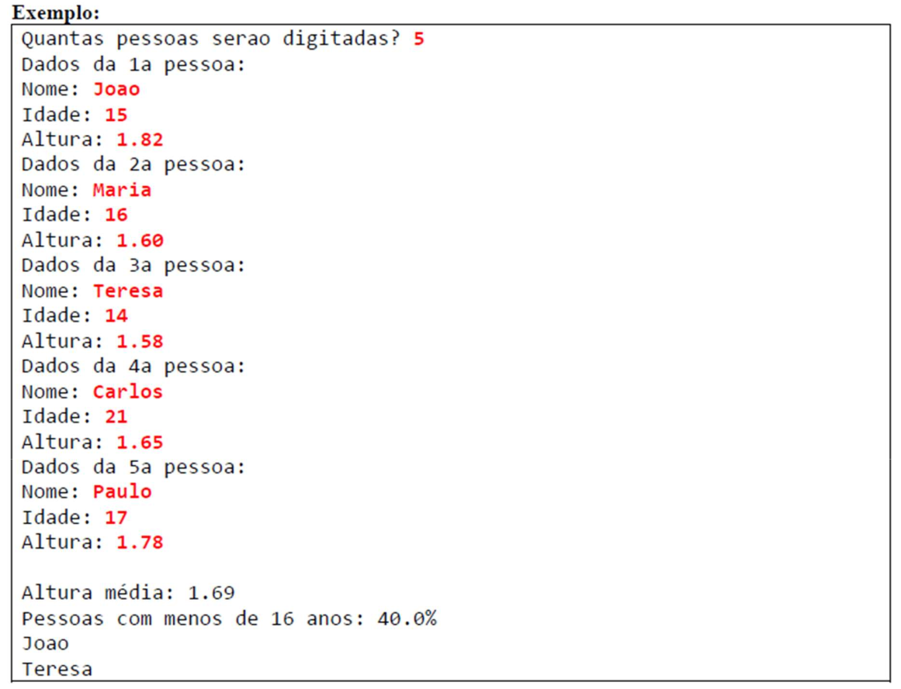
```
algoritmo "ExercicioVetor3"
var
   n,i,contadorMenores: inteiro
   idade: vetor[0..5]de inteiro
   altura: vetor[0..5]de  real
   nome: vetor [0..5] de caractere
   somaAltura, alturaMedia, porcentagemMenores: real
inicio
   escreval ("Quantas Pessoas Serão Informadas? ")
   leia (n)

   contadorMenores <- 0
   somaAltura <- 0


   para i de 1 ate n faca
      escreval ("Dados da Pessoa N° ",i,"!")
      escreva ("Nome :")
      leia (nome[i])
      escreva ("Idade :")
      leia (idade[i])
      escreva ("Altura :")
      leia (altura[i])

      somaAltura <- somaAltura + altura[i]

      se idade[i] < 16 entao
         contadorMenores <- contadorMenores + 1

      fimse
   fimpara

   alturaMedia <- somaAltura / n
   porcentagemMenores <- (contadorMenores / n)* 100

   escreval("Altura Média :",alturaMedia:1:2)
   escreval("Pessoas com menos de 16 anos: ",porcentagemMenores:3:1,"%")

   para i de 1 ate n faca
        se idade[i] < 16 entao
        
           escreval(nome[i])

   fimpara
fimalgoritmo
```
**04 - Faça um programa que leia N números inteiros e armazene-os em um vetor.
Em seguida, mostre na tela todos os números pares, e também a quantidade de
números pares.**

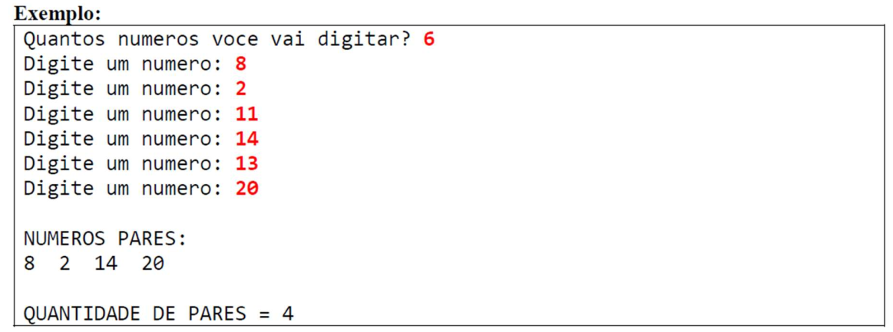
```
algoritmo "ExercicioVetor4"
var
   contadorPares,n,i: inteiro
   numero: vetor [0..6] de inteiro
inicio
   escreval ("Quantos numeros você vai Digitar? ")
   leia (n)

   contadorPares <-  0

   para i de 1 ate n faca
      escreval("Digite um número: ")
      leia(numero[i])

      se (numero[i]% 2 = 0) entao
         contadorPares <- contadorPares + 1
      fimse
   fimpara

   escreval("NÚMEROS PARES :")
   para i de 1 ate n faca

      escreva (numero[i]," ")
   fimpara
   escreval()
   escreval ("QUANTIDADE DE PARES =",contadorPares)


fimalgoritmo

```
**05 - Faça um programa que leia N números reais e armazene-os em um vetor. Em
seguida, mostrar na tela o maior número do vetor (supor não haver empates).
Mostrar também a posição do maior elemento, considerando a primeira posição
como 0 (zero).**

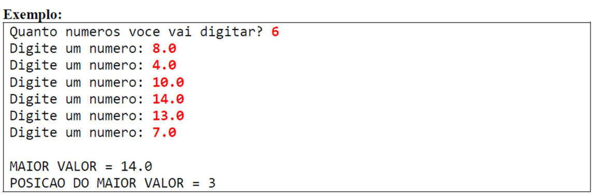
```
algoritmo "ExercicioVetor5"
var
   vetR: vetor[0..6]de real
   n,i, posicaoMaior: inteiro
   maiorNumero: real
inicio
      escreval("Quantos Números você vai Digitar? ")
      leia (n)
      
      para i de 0 ate n-1 faca
           escreva("Digite um Número:  ")
           leia (vetR[i])
      fimpara
      
      maiorNumero <- (vetR[0])
      posicaoMaior <- 0
      
      para i de 1 ate n-1 faca
      
           se vetR[i] > maiorNumero entao
              maiorNumero <- vetR[i]
              posicaoMaior <- i
           
           fimse
      fimpara
      
      escreva ("Maior Valor =  ",maiorNumero:3:1)
      escreval()
      escreva ("Posição do Maior Valor= ",posicaoMaior)
      
           
fimalgoritmo

```
**06 - Faça um programa para ler dois vetores A e B, contendo N elementos cada.
Em seguida, gere um terceiro vetor C onde cada elemento de C é a soma dos
elementos correspondentes de A e B. Imprima o vetor C gerado.**

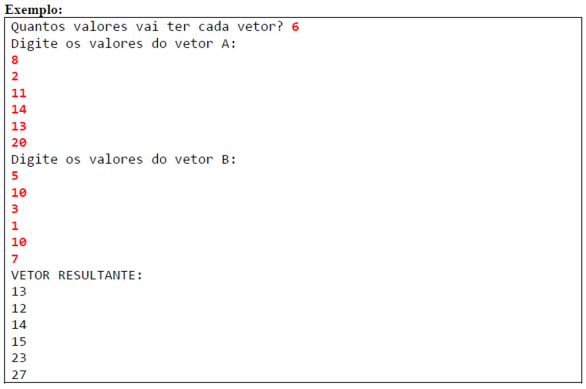
```
algoritmo "ExercicioVetor6"
var
   vetA: vetor [0..6] de inteiro
   vetB: vetor [0..6] de inteiro
   vetC: vetor [0..6] de inteiro
   n,i: inteiro
inicio
      escreval ("Quantos valores vai ter cada Vetor? ")
      leia (n)
      
      escreval ("Digite os Valores do Vetor A :")
      para i de 1 ate n faca
      
           escreva ("N°",i,": ")
           leia (vetA[i])
           escreval()
           
      fimpara
      
      escreval ("Digite os Valores do Vetor B :")
      para i de 1 ate n faca

           escreva ("N°",i, ": "
           leia (vetB[i])
           escreval()
           
      fimpara
      
      escreval("Vetor Resultante: ")
      para i de 1 ate n faca
           vetC[i] <- (vetA[i] +  vetB[i])
           escreval(vetC[i])
      fimpara
fimalgoritmo

```
**07 - Fazer um programa para ler um número inteiro N e depois um vetor de N
números reais. Em seguida, mostrar na tela a média aritmética de todos elementos com três casas decimais. Depois mostrar todos os elementos do vetor que estejam abaixo da média, com uma casa decimal cada.**

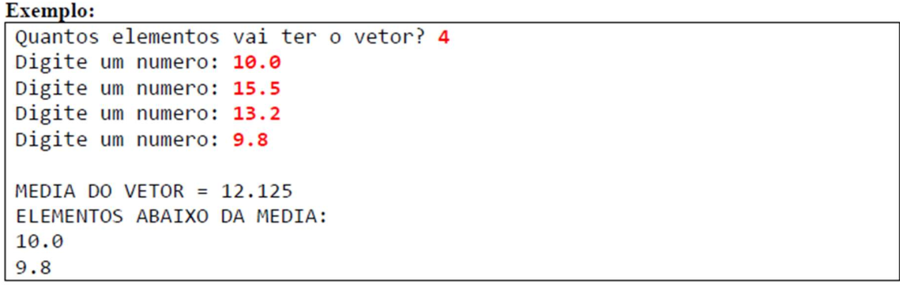
```
algoritmo "ExercicioVetor7"
var
   i,n: inteiro
   mediaVetor,somaVetor,abaixoDaMedia: real
   vetN: vetor [0..4] de real
inicio
      escreval("Quantos Elementos vai ter o Vetor? ")
      leia (n)
      
      somaVetor <- 0
      
      para i de 0 ate n-1 faca
          escreva("Digite um Número: ")
          leia (vetN[i])
          escreval()
          somaVetor <-somaVetor + vetN[i]
      fimpara
      

      mediaVetor <- somaVetor/n
      
      escreval ("MÉDIA DO VETOR =",mediaVetor:3:3)
      escreval("ELEMENTOS ABAIXO DA MEDIA: ")
      
      para i de 0 ate n-1 faca
          se vetN[i]< mediaVetor entao
            abaixoDaMedia <- vetN[i]
            escreval(abaixoDaMedia:3:1)
          fimse
      fimpara

fimalgoritmo

```
**08 - Fazer um programa para ler um vetor de N números inteiros. Em seguida,
mostrar na tela a média aritmética somente dos números pares lidos, com uma casa
decimal. Se nenhum número par for digitado, mostrar a mensagem "NENHUM
NUMERO PAR"**

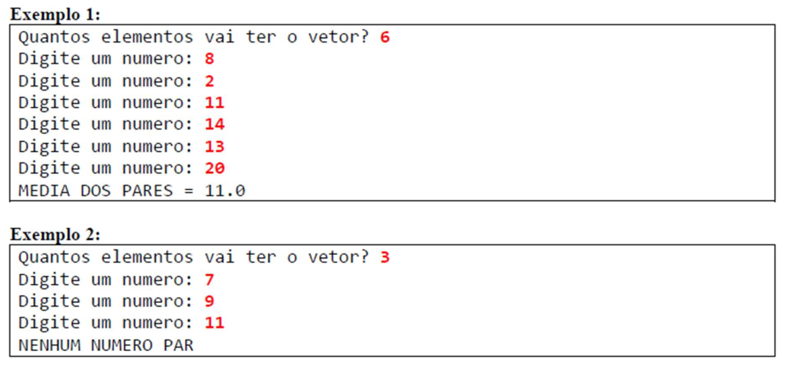
```
algoritmo "ExercicioVetor8"
var
   n, i, contadorPares, somaPares : inteiro
   vetN: vetor [0..6] de inteiro
   mediaPares: real
inicio
   escreva ("Quantos Elementos vai ter o vetor? ")
   leia (n)
   escreval()

   para i de 1 ate n faca
      escreva("Digite um Número: ")
      leia (vetN[i])
      escreval()

      se (vetN[i]% 2 = 0) entao
         somaPares <- somaPares + vetN[i]
         contadorPares <- contadorPares + 1
      fimse
   fimpara

   se (somaPares = 0) entao
      escreval("Nenhum Número Par!")
   senao
      mediaPares <- somaPares / contadorPares
      escreval("Média dos Números Pares: ",mediaPares:3:1)
   fimse

fimalgoritmo

```
**09 - Fazer um programa para ler um conjunto de nomes de pessoas e suas respectivas idades. Os nomes devem ser armazenados em um vetor, e as idades em um outro vetor. Depois, mostrar na tela o nome da pessoa mais velha.**

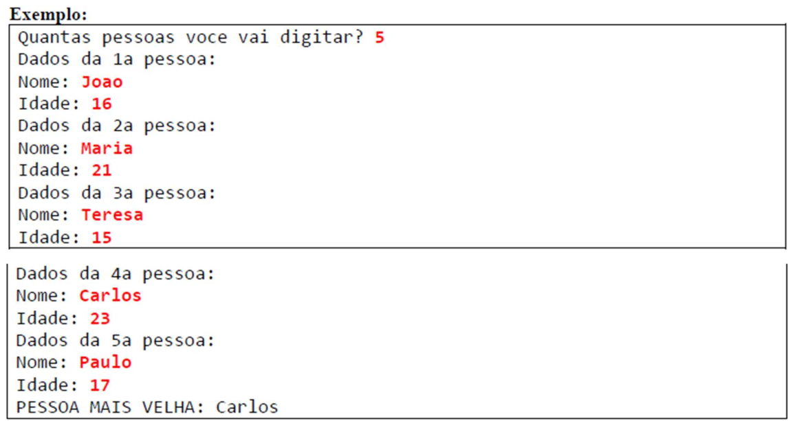
```
algoritmo "ExercicioVetor9"
var
   vetIdade: vetor [0..5] de inteiro
   vetNomes: vetor [0..5] de caractere
   n,i,maisVelho: inteiro
   identificador: caractere
inicio
      escreva("Quantas Pessoas voçê irá Verificar? ")
      leia(n)
      escreval()
      
      maisVelho <- vetIdade[0]
      
      para i de 1 ate n faca
      
          escreva("Dados da ",i,"° Pessoa: ")
          escreval()
          escreva("Nome: ")
          leia (vetNomes[i])
          escreval()
          escreva("Idade: ")
          leia(vetIdade[i])
          escreval()
          
          se (vetIdade[i] > maisVelho) entao
             maisVelho <- vetIdade[i]
             identificador <- vetNomes[i]
          fimse
      fimpara
      
      escreval("Pessoa Mais Velha: ",identificador)
      escreval("Com a Idade De ",maisVelho," Anos de Idade")
fimalgoritmo

```
**10 - Fazer um programa para ler um conjunto de N nomes de alunos, bem como as notas que eles tiraram no 1º e 2º semestres. Cada uma dessas informações deve ser armazenada em um vetor. Depois, imprimir os nomes dos alunos aprovados, considerando aprovados aqueles cuja média das notas seja maior ou igual a 6.0 (seis).**

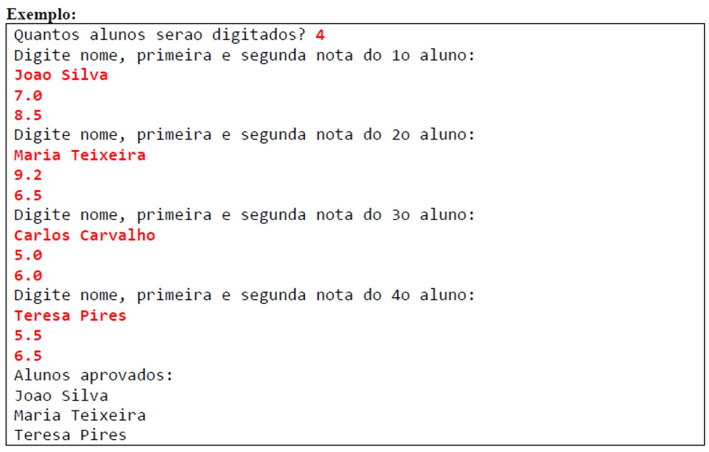
```
algoritmo "ExercicioVetor10"
var
   n,i: inteiro
   vetN1: vetor[0..4] de real
   vetN2: vetor[0..4] de real
   vetNome: vetor [0..4] de caractere


inicio
      escreval ("Quantos alunos serão Digitados? ")
      leia (n)
      
      para i de 1 ate n faca
           escreval("Digite Nome, primeira e segunda nota do ",i,"ª Aluno: ")
           leia (vetNome[i])
           leia (vetN1[i])
           leia (vetN2[i])

      fimpara
      
      escreval("Alunos Aprovados: ")
      para i de 1 ate n faca
      
           se (vetN1[i]+vetN2[i]) /2 >= 6  entao

             escreval(vetNome[i])
             
           fimse
      fimpara

fimalgoritmo

```
**11 - Tem-se um conjunto de dados contendo a altura e o gênero (M, F) de N pessoas. Fazer um programa que calcule e escreva a maior e a menor altura do grupo, a média de altura das mulheres, e o número de homens.**

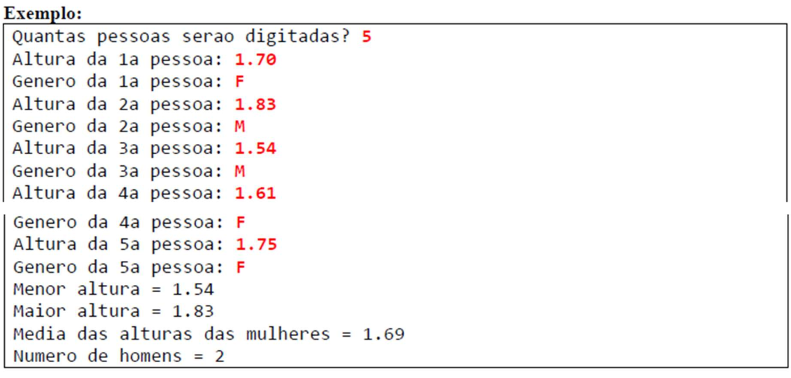
```
algoritmo "ExercicioVetor11"
var
   n, i, contH, contF: inteiro
   vetG: vetor [0..4] de caractere
   vetAlt: vetor [0..4] de real
   mediaMulheres, menorAltura, maiorAltura, somaAltura: real

inicio
   escreva("Quantas pessoas serão digitadas: ")
   leia(n)

   menorAltura <- vetAlt[0]
   maiorAltura <- vetAlt[0]
   somaAltura <- 0
   contF <- 0
   contH <- 0

   para i de 0 ate n-1 faca
      escreva("Altura da ", i+1, "ª pessoa: ")
      leia(vetAlt[i])
      escreva("Gênero da ", i+1, "ª pessoa: ")
      leia(vetG[i])

      se vetG[i] = "f" entao
         somaAltura <- somaAltura + vetAlt[i]
         contF <- contF + 1
      senao
         contH <- contH + 1
      fimse


   fimpara

   menorAltura <- vetAlt[0]
   maiorAltura <- vetAlt[0]

   i <- 0
   enquanto i < n faca
      se vetAlt[i] < menorAltura entao
         menorAltura <- vetAlt[i]
      fimse

      se vetAlt[i] > maiorAltura entao
         maiorAltura <- vetAlt[i]
      fimse

      i <- i + 1
   fimenquanto

   mediaMulheres <- somaAltura / contF

   escreva("Menor Altura = ", menorAltura:1:2)
   escreval()
   escreva("Maior Altura = ", maiorAltura:1:2)
   escreval()
   escreva("Média das alturas das Mulheres = ", mediaMulheres:2:2)
   escreval()
   escreva("Número de Homens = ", contH)

fimalgoritmo

```
**12 - Um comerciante deseja fazer o levantamento do lucro das mercadorias que ele comercializa. Para isto, mandou digitar um conjunto de N mercadorias, cada uma
contendo nome, preço de compra e preço de venda das mesmas. Fazer um programa que leia tais dados e determine e escreva quantas mercadorias proporcionaram:
lucro < 10%
10% ≤ lucro ≤ 20%
lucro > 20%
Determine e escreva também o valor total de compra e de venda de todas as mercadorias, assim como o lucro total.**

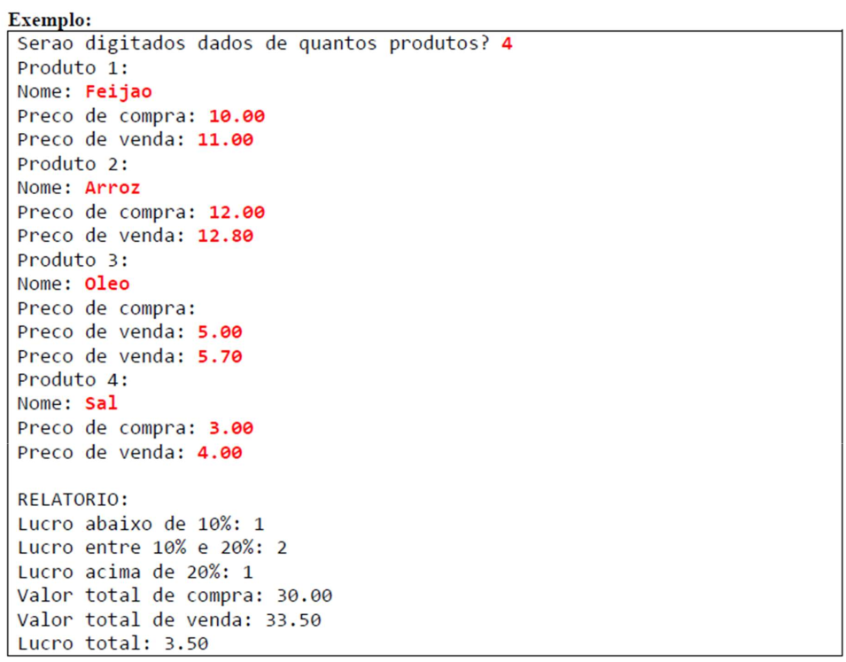
```
algoritmo "ExercicioVetor12"

var
   n, i, contLucroMenor10, contLucroEntre10E20, contLucroMaior20: inteiro
   nome: vetor[1..5] de caractere
   precoCompra, precoVenda, lucro, lucroTotal, valorCompraTotal, valorVendaTotal: real

inicio
   escreva("Serão digitados dados de quantos produtos? ")
   leia(n)

   contLucroMenor10 <- 0
   contLucroEntre10E20 <- 0
   contLucroMaior20 <- 0
   lucroTotal <- 0
   valorCompraTotal <- 0
   valorVendaTotal <- 0

   para i de 1 ate n faca
      escreva("Produto ", i, "ª: ")
      leia(nome[i])
      escreva("Preço de compra: ")
      leia(precoCompra)
      escreva("Preço de venda: ")
      leia(precoVenda)

      valorCompraTotal <- valorCompraTotal + precoCompra
      valorVendaTotal <- valorVendaTotal + precoVenda

      lucro <- precoVenda - precoCompra
      lucroTotal <- lucroTotal + lucro

      se lucro < (precoCompra * 0.1) entao
         contLucroMenor10 <- contLucroMenor10 + 1
      senao
         se (lucro >= (precoCompra * 0.1)) e (lucro <= (precoCompra * 0.2)) entao
            contLucroEntre10E20 <- contLucroEntre10E20 + 1
         senao
            contLucroMaior20 <- contLucroMaior20 + 1
         fimse
      fimse
   fimpara

escreval ("Relatório: ")
   escreva("Lucro Abaixo de 10%: ", contLucroMenor10)
   escreval()
   escreva("Lucro Entre 10% e 20%: ", contLucroEntre10E20)
   escreval()
   escreva("Lucro Acima de 20%: ", contLucroMaior20)
   escreval()
   escreva("Valor total de compra R$:", valorCompraTotal:2:2)
   escreval()
   escreva("Valor total de vendas R$:", valorVendaTotal:2:2)
   escreval()
   escreva("Lucro totalR$:", lucroTotal:2:2)

fimalgoritmo

```
### The End! 
### Muito Obrigado!
